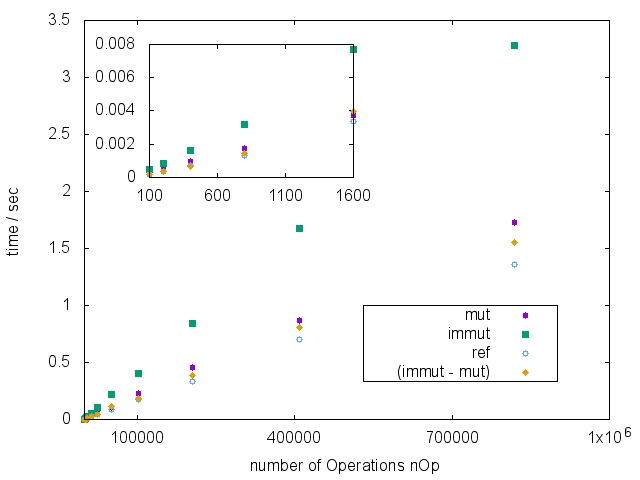
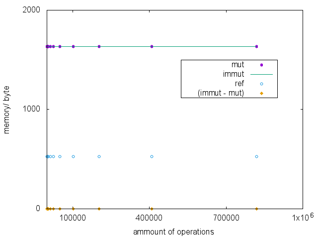

# Immutable Objects Benchmark

This repository provides you with a benchmarking script to check temporal and memory performance difference between setter operations (will be refered to as operations below) on mutable and immutable objects. We find an increase in running time, but no change in memory consumption. Allthough there _is_ an increase in running time, it does not change the order of magnitude. In our case we find an average time difference of about 2E-6 seconds per operation. Assuming 10E3 operations per pageload (which is a lot), we expect that once we have a large offset due to the environment (other objects, which are not immutable, as well as database interaction) it will not be possible to tell the difference.

Our sample, **class.immutableSample.php**, is a simple object with a series of public setters. The function of it's setters depends on the **$mutable** property of the object. They may be operated in two distinct ways:
1. an immuable way, i.e. a new immutable object, being identical to the object the operation is called on up to the changed property, will be created, whenever you try to set a property. 
2. a mutable way, i.e. the object itself will be changed. 
We create such an object and perform setter operations on them. The amount of these operations is variable and the type of any single operation is chosen randomly at runtime, we thus hope to represent a broad variety of usecases with this benchmark. The object, on which the setter is called, is replaced by the return value of the setter operation, being the same object in the mutable case and a new object with one different property in the immutable case. Please confer class.immutableSample.php for further information.
We also capture reference data in additional runs, in which we perform no setter operations on the object, just to measure the environmental offset in time and memory consumprion.

The results are presented in following two graphs:

Here we see the duration of execution depending on the numbers of operation. As expected, it takes longer to deal with immutable objects. The overhead above reference offset is roughly four times bigger for immutable objects compared to their mutable variants. However, the difference per operation is only about 2E-6 seconds (2,5 GHz Intel Core i5, 8 GB 1600 MHz DDR3, OS X El Capitan, PHP 5.5.29), which makes it relevant only on the scale of 10E5 operations. Such heavy workload is rare in usual web applications.

Here we see the memory consumption depending on the numbers of operation. It's same for both, mutable and nonmutable, objects and is independent of the amount of operations. The reason for this is the way of memory allocation of PHP. It uses reference counting, i.e. once an object is not referenced anymore, it's memory is released.

