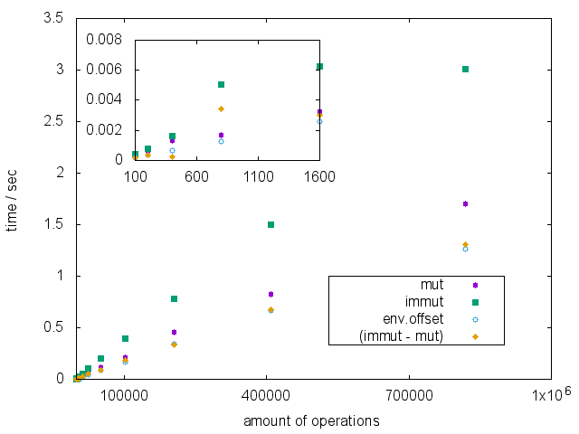

# Immutable Objects Benchmark

This repository provides you with a benchmarking script to check temporal and memory performance difference between mutable and immutable objects.

Our sample, **class.immutableSample.php** , is a simple object with a series of public setter, that may operate in an immuable or a mutable way 
depending on the **$mutable** property. We create such an object and perform setter operations on them. The ammount of this operations is variable.

The results are presented in folloing two images:

Here we see the duration of execution depending on the numbers of operation. Obviously it takes longer to deal with immutable objects. Though the difference becomes relevant only on the scale of thousands of operations.

Here we see the memory depending on the numbers of operation. Surprisingly it's same for both, mutable and nonmutable, objects and independent of ammount of the operations.

